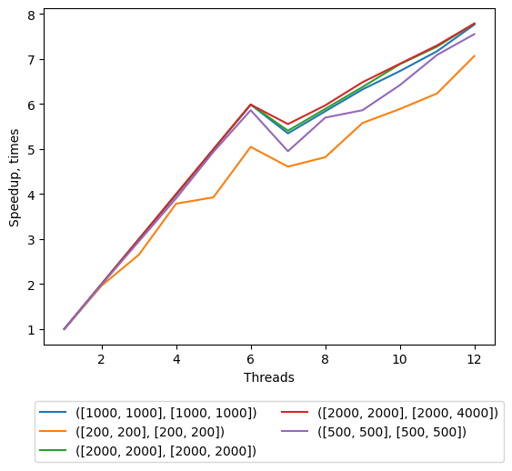

## Lab 1 Parallel Matrix Multiplication with OpenMP

Requirements:
* gcc (9+ for stable std::filesystem)
* cmake (3.14+)
* openmp (part of gcc-9)
* python3 (3.6+ for f-strings)
  * matplotlib
  
System info:
* OS: Ubuntu Linux 18.04
* CPU info: [lscpu output](./cpu_characteristics.md)

Benchmark results could be found on [GDrive folder](https://drive.google.com/drive/folders/19qHRaOD4-fhEXwkaPt3r8iA10EfreSiD?usp=sharing).

### Speedup with different schedule types comparison 
Speedup is relative to the sequential run for the same matrix of the same size.
All 12 logical cores are used for this benchmark.

### Column-oriented right matrix representation optimization

### Speedup on number of threads dependence

