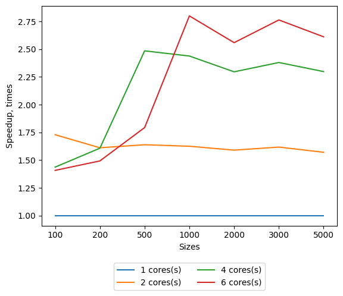
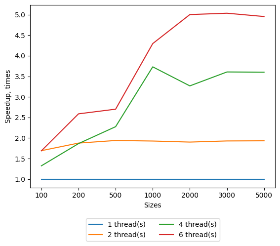

## Lab 2 Parallel Jacobi linear systems solver with MPI

Requirements:
* gcc (9+ for stable std::filesystem and c++17)
* cmake (3.14+)
* OpenMPI
  * [Installation steps for Linix and gcc](./md/mpi_installation_guide.md)
* python3 (3.6+ for f-strings)
  * matplotlib
  
System info:
* OS: Ubuntu Linux 18.04
* CPU info: [lscpu output](../lab1/md/cpu_characteristics.md)

Benchmark results could be found on [GDrive folder](https://drive.google.com/drive/folders/1OeWdXX4eUUNIVDI0G8JGCLD6O1XWN0lU?usp=sharing).

Refer to [Run giude](./md/mpi_run_guide.md) to learn how to build and run Jacobi solver from this sources.

Given linear system `A * x = b`, where A is coefficients matrix, `x` - unknown vector and `b` is a free column. Also given `eps`, desired precision of `xi` and initial approximation of `x`. It is proven that Jacobi method converge for Strictly Diagonal Dominant matrices, thus this implementation accepts only such matrices.

Implemented algorithm is following:

1. Main process reads linear system from input files
2. Main process broadcasts data (coefficients, b column, initial approximations) to others.
 Also main process calculates batches for worker processes.
3. Each process runs Jacobi method iterations over its batch.
 For each iteration, relative part of `new_x` vector is computed on each worker, based on previous iteration's `x` vector.
4. All processes gather parts of `new_x` vector, store them as `prev_x` and start the next iteration.
5. Iterations will stop if either convergence conditions are satisfied or the iterations limit is exceeded. 
Algorithm uses the following convergence criteria: `||new_x - prev_x|| < eps`, where `||x||` is first norm. It is generally not the best condition, but requires less computations on each iteration and sufficient enough for SDD matrices.
6. Main process prints calculated x vector to output file

### Speedup for various system sizes

This graph represents results achieved with the above algorithm. Running times were measured for algorithm steps 2 - 5. 
Broadcasting step (2) is captured too because it is one of the most significant overheads of MPI, especially for systems with shared memory, where broadcasting could be omitted.
However this overhead can be reduced if broadcasting in step (2) will be replaced with scattering the data instead.
Results of the scattering optimization version is shown on the second graph.
It shows that for big clusters, the problem of costly messaging should be seriously considered. While on 2-cores cluster speedup is not so noticeable.
Results are compliable with the Gunter scalability law.

### Speedup with the optimized coefficients broadcasting

