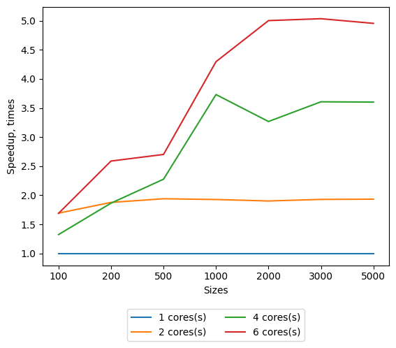

## Lab 2 Parallel Jacobi linear systems solver with MPI

Requirements:
* gcc (9+ for stable std::filesystem and c++17)
* cmake (3.14+)
* OpenMPI
  * [Installation steps for Linix and gcc](./md/mpi_installation_guide.md)
* python3 (3.6+ for f-strings)
  * matplotlib
  
System info:
* OS: Ubuntu Linux 18.04
* CPU info: [lscpu output](md/cpu_characteristics.md)

Benchmark results could be found on [GDrive folder](https://drive.google.com/drive/folders/1OeWdXX4eUUNIVDI0G8JGCLD6O1XWN0lU?usp=sharing).

Refer to [Run giude](./md/mpi_run_guide.md) to learn how to build and run Jacobi solver from this sources.

### Speedup for various system sizes

### Speedup with the optimized coefficients broadcasting

