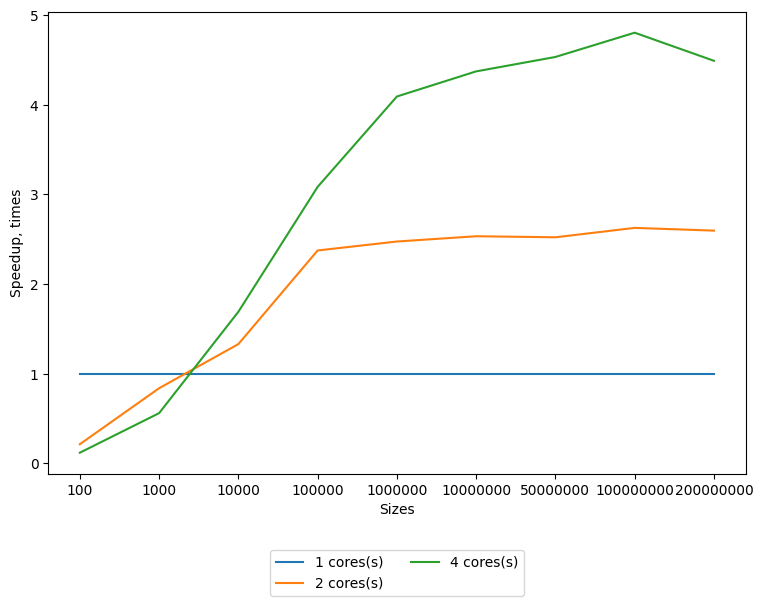
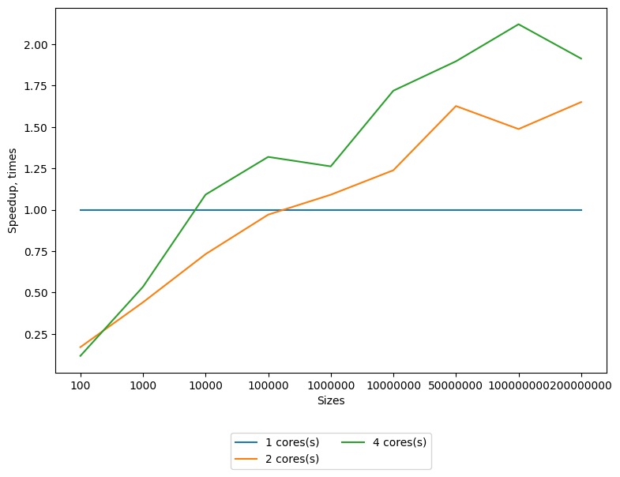
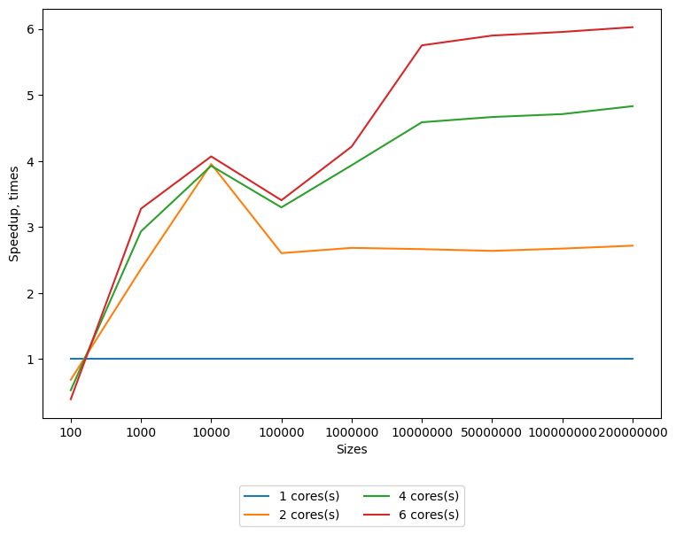

## Lab 3 Parallel Quicksort with MPI

Requirements:
* gcc (9+ for stable std::filesystem and c++17)
* cmake (3.14+)
* OpenMPI
  * [Installation steps for Linix and gcc](./md/mpi_installation_guide.md)
* python3 (3.6+ for f-strings)
  * matplotlib
  
System info:
* OS: Ubuntu Linux 18.04
* CPU info: [lscpu output](../lab1/md/cpu_characteristics.md)

Benchmark results could be found on [GDrive folder](https://drive.google.com/drive/folders/1Jh6aeOSJUaHjqyEtNUFMLFRvb9dGE1MC?usp=sharing).

Refer to [Run giude](./md/mpi_run_guide.md) to learn how to build and parallel sort from this sources.

Implemented algorithm is following:

Covered in this report algorithms share the common idea of splitting a given array into parts, sorting parts individually and then combine sorted results.

### Speedup with Hypercube repartition algorithm

The core treat of this algorithm is that the merge part is omitted by the batches repartitioning before actual independent sortings.
The biggest disadvantage of this algorithm is that it is highly dependent on a pivot choose. 
The loosely chosen pivot will result in a very unbalanced partitioning.
This means that the biggest part of the sorting will be made on a single core, neglecting all benefits from multithreading.
So a lot of effort was put into choosing a better partitioning algorithm. 
The best option is to take a median element, but this requires full ordering of partitions.
The good approximation of the total ordering is finding median of the randomly sampled subarray.
This graph was made with taking median of 100 randomly sampled elements on each iteration.
Described approach helped to significantly improve stability of running time.
Previous runs, without such optimization could be found on gdrive folder.

With pivot sampling optimization

W/o pivot optimization (central element)

### Speedup with tree topology merging algorithm

The main idea of this algorithm is to split whole array in equal batches and sort them independently.
It approaches combining with merge of sorted batches. We could merge all parts at main process or apply a tree topology merging.
Each process sends its sorted subsequence to its neighbor and a merge operation is performed at each step. 
Thus the merging of subarrays performed concurrently on pairs of processes.

