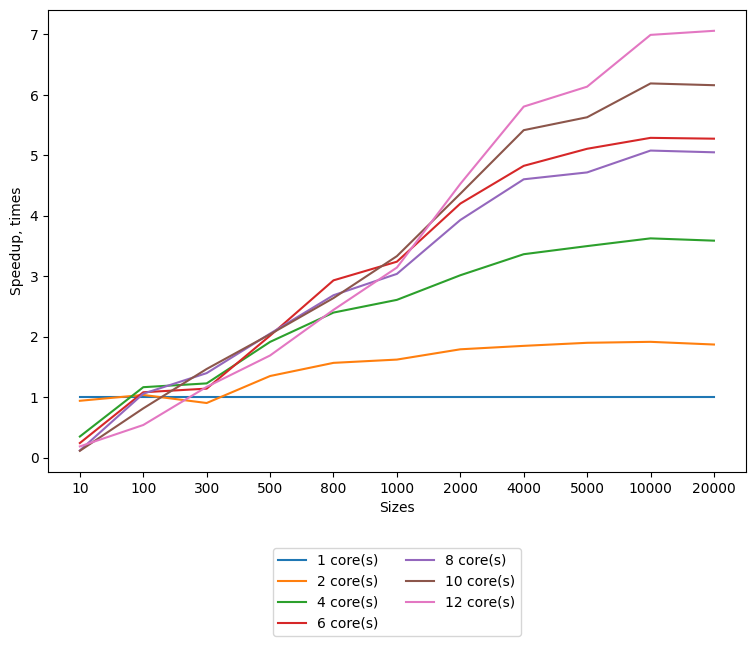

## Lab 4 Parallel Dijkstra algorithm with OpenMP

Requirements:
* gcc (9+ for stable std::filesystem and c++17)
* cmake (3.14+)
* openmp (part of gcc-9)
* python3 (3.6+ for f-strings)
  * matplotlib

System info:
* OS: Ubuntu Linux 18.04
* CPU info: [lscpu output](../lab1/md/cpu_characteristics.md)

Benchmark results could be found on [GDrive folder](https://drive.google.com/drive/folders/1PE1zz804wFzeBO6RbOfv-GltMyzoxwBz?usp=sharing).

Refer to [Run giude](./md/run_guide.md) to learn how to build and parallel sort from this sources.

### Task

For a given graph's weighted incidence matrix find shortest paths for all reachable vertices.
Using a parallel implementation of the Dijkstra Single Source Shortest Path algorithm. 

### Approach
Dijkstra SSSP algorithm is the following:
* Perform `|V|-1` of next steps:
    * Find a closest vertex to the subgraph of already covered vertices (initially contains the source vertex only)
    * Add it to the subgraph
    * Relax distances for all outgoing from the added vertex edges 

Dijkstra algorithms is a greedy iterative one with two synchronization points: finding a closest vertex and the end of an iteration.
So there is two parallelizable parts: finding minimal distance and relaxing edges.

Parallel parts are the following (each is distributed between `p` processes): 
1. Each process finds the minimal distance in its batch of the distances array, then the main process performs a reduction on the array of local minimums.
Asymptotic is `O(|V|/p + p)`
2. Every process relaxes ist own batch of edges. Asymptotic is `O(|V|/p)`

Running time of the implemented solution is `O(|V| * (|V|/p + p))`, where `|V|` is vertex set size, `p` - number of processes.

### Benchmarking

The above graph was made for a full graph (without self-loops) with `|E| = Θ(|V|^2)`.
One could observe that for small graphs overhead for the threads startup dominates over speedup gained from concurrency.
In the studied algorithm an each thread job is almost equal.
This is confirmed with tests for different openmp scheduling types (could be found on gdrive). As expected, they did not show any difference for `static`, `guided` and `dynamic` schedulers.
